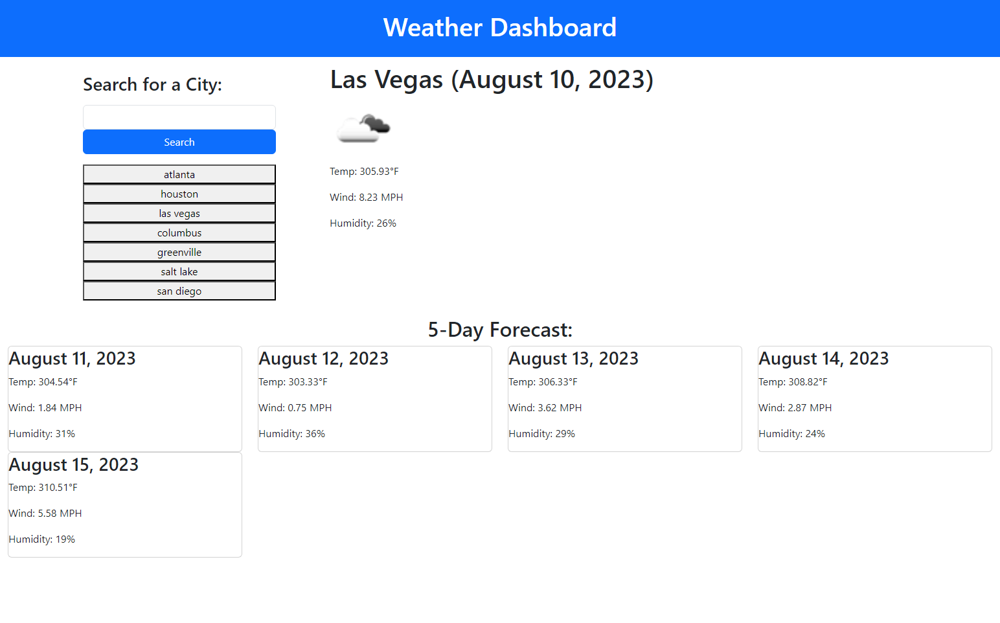

# 5-Day-Weather-Dashboard

## Description
This repository allows users to search for a city, and view the current and 5 day weather forecast.  Users search inputs are stored locally allowing them to go back to a previous forecast.

To view the Webpage click [here] (https://patrickodea.github.io/Password-Generator/).

## Usage
Users will type a city name into the search bar.

The user will then click search and view the current weather and a 5-Day Forecast for the chosen city.

The cities searched will be displayed from local storage, and the user will be able click the city name and be taken back to previous weather data.